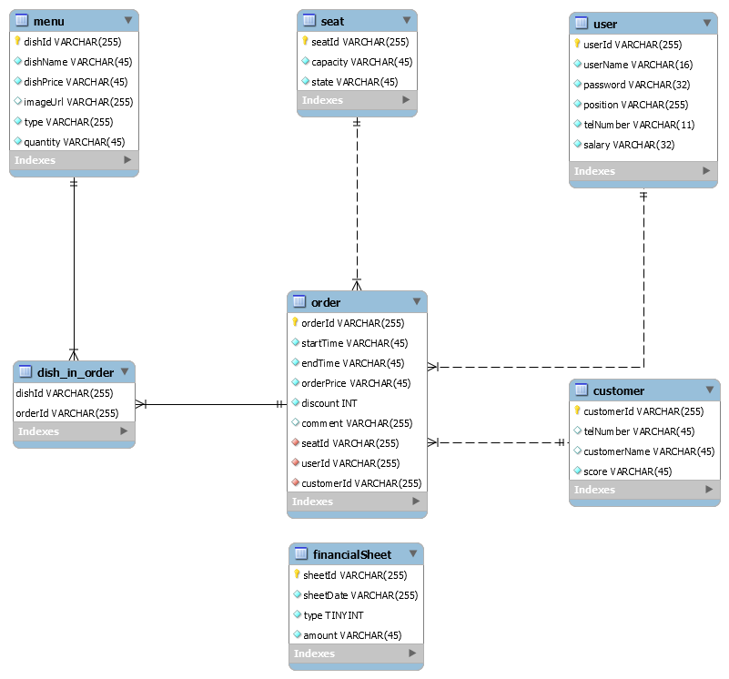

# RestaurantManager
## 阅读之前
- 感谢[lxc大佬](https://github.com/ppdog0)的帮助有需要也可参考他们组的[javaee-project](https://github.com/ppdog0/java-ee-project)
- 此项目是javaee小学期的项目,主体框架~~不得不用~~ jsf/javaee
## 说明
- [需求文档](/doc/需求文档.pdf)
### database
- ER图

  
- [数据库说明](/doc/entity.md)
- [数据库接口](/doc/数据库接口.md)
- [从Excel表格中导入数据](/doc/添加数据库),请勿修改Excel文件中的列名或者增加列，date使用的是当前时间，如有需要请手动修改
### 前端
- [前端接口](doc/前端接口.md)
## 日志
- 2020/09/06 ~~新建文件夹~~
- 2020/09/08 后端entity与ejb基本完成
